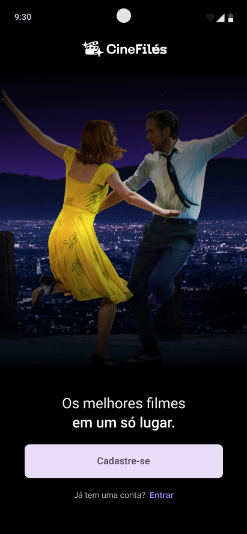
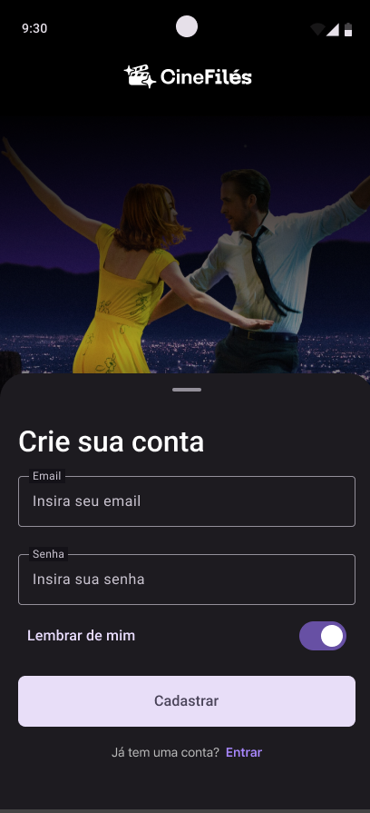
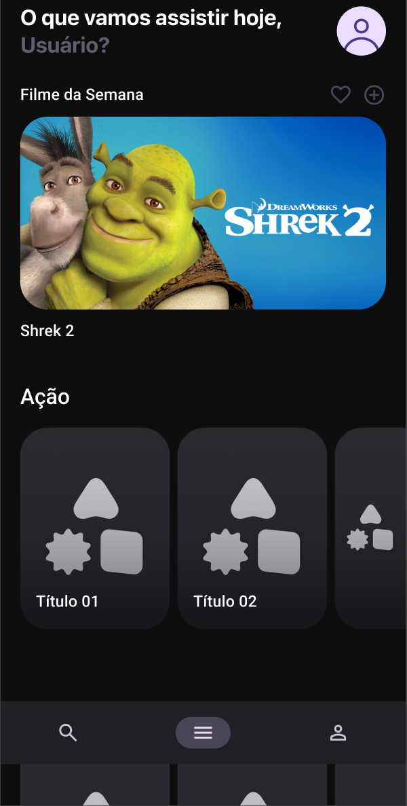
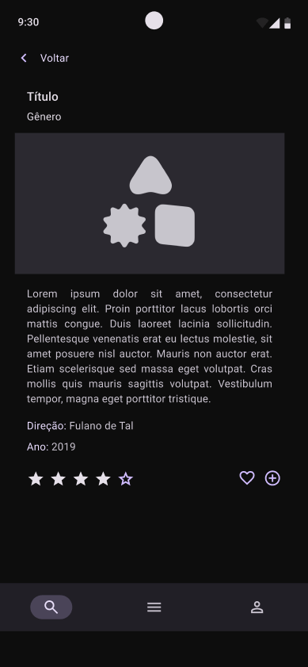

# CineFiles

<div align="center">
  
</div>

Android application for managing and viewing movie information.

## Screenshots

<div align="center">
  
  
  
  
</div>

## Developer

**Mateus Augusto Costa Santos**

## Technologies

- Android SDK
- Kotlin
- MVVM Architecture
- Retrofit
- Room Database
- TMDB API

## Setup


### 2. Configure local.properties

Add your TMDB API key to `local.properties`:

```properties
TMDB_API_KEY=your_api_key_here
```

## How to Run

1. Clone the repository
2. Open the project in Android Studio
3. Configure your API key as described above
4. Sync Gradle
5. Run the app

## License

This project is for educational purposes.
