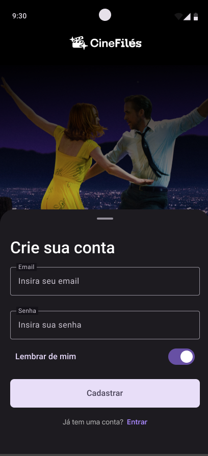
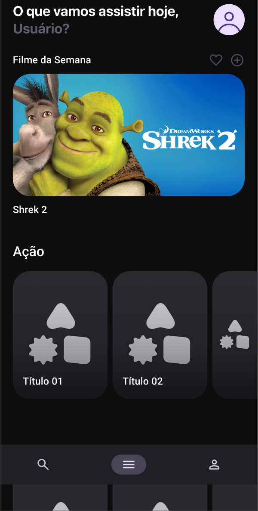
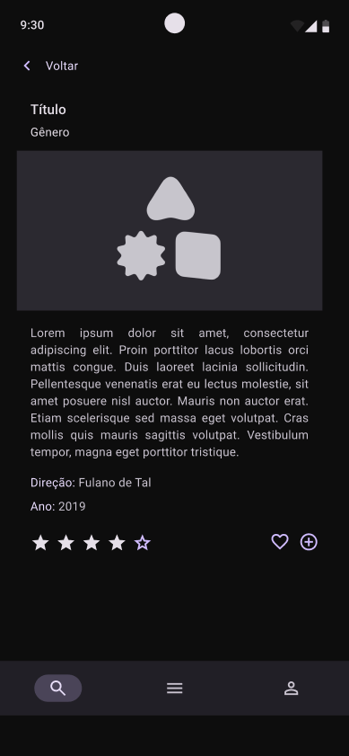

# CineFiles

  

Android application for managing and viewing movie information.

## 📱 Screenshots

  
  
  
  

## Developer

Developed by **AndreOids** - Mobile Development Solutions

## Technologies

- Kotlin
- Jetpack Compose
- Android SDK

## How to Run

1. Clone the repository
2. Open the project in Android Studio
3. Sync Gradle
4. Run on emulator or physical device

## License

This project is licensed under the license specified in the LICENSE file.

